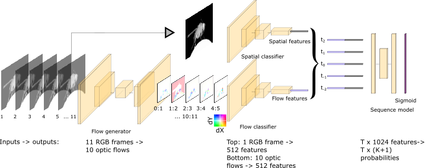

# DeepEthogram
- Written by Jim Bohnslav, except where as noted
- JBohnslav@gmail.com

DeepEthogram is an open-source package for automatically classifying each frame of a video into a set of pre-defined 
behaviors. Designed for neuroscience research, it could be used in any scenario where you need to detect actions from 
each frame of a video.

Example use cases:
* Measuring itching or scratching behaviors to assess the differences between wild-type and mutant animals
* Measuring the amount of time animals spend courting, and comparing between experimental conditions
* Counting licks from video for appetite measurement
* Measuring reach onset times for alignment with neural activity

DeepEthogram uses state-of-the-art algorithms for *temporal action detection*. We build on the following previous machine 
learning research into action detection:
* [Hidden Two-Stream Convolutional Networks for Action Recognition](https://arxiv.org/abs/1704.00389)
* [Temporal Gaussian Mixture Layer for Videos](https://arxiv.org/abs/1803.06316)

## Installation
For full installation instructions, see [this readme file](docs/installation.md). 

In brief: 
* [Install PyTorch](https://pytorch.org/) 
* `pip install deepethogram`

## News
DeepEthogram is now in Beta, version 0.1! There are major changes to the codebase and to model training and inference. Model performance, measured by F1, accuracy, etc. should be higher in version 0.1. Model training times and inference times should be dramatically reduced. For full information, see [the DeepEthogram Beta docs](docs/beta.md)

## Pretrained models
Rather than start from scratch, we will start with model weights pretrained on the Kinetics700 dataset. Go to 
To download the pretrained weights, please use [this Google Drive link](https://drive.google.com/file/d/1ntIZVbOG1UAiFVlsAAuKEBEVCVevyets/view?usp=sharing).
Unzip the files in your `project/models` directory. Make sure that you don't add an extra directory when unzipping! The path should be 
`your_project/models/pretrained_models/{models 1:6}`, not `your_project/models/pretrained_models/pretrained_models/{models1:6}`.

## Licensing
Copyright (c) 2020 - President and Fellows of Harvard College. All rights reserved.

This software is free for academic use. For commercial use, please contact the Harvard Office of Technology 
Development (hms_otd@harvard.edu) with cc to Dr. Chris Harvey. For details, see [license.txt](license.txt). 

## Usage
### [To use the GUI, click](docs/using_gui.md)
#### [To use the command line interface, click](docs/using_CLI.md)

## Dependencies
The major dependencies for DeepEthogram are as follows: 
* pytorch, torchvision: all the neural networks, training, and inference pipelines were written in PyTorch
* pytorch-lightning: for nice model training base classes
* kornia: for GPU-based image augmentations
* pyside2: for the GUI
* opencv: for video and image reading and writing
* opencv_transforms: for fast image augmentation
* scikit-learn, scipy: for binary classification metrics
* matplotlib: plotting metrics and neural network outputs
* pandas: reading and writing CSVs
* h5py: saving inference outputs as HDF5 files
* omegaconf: for smoothly integrating configuration files and command line inputs
* tqdm: for nice progress bars

## Hardware requirements
For GUI usage, we expect that the users will be working on a local workstation with a good NVIDIA graphics card. For training via a cluster, you can use the command line interface. 

* CPU: 4 cores or more for parallel data loading
* Hard Drive: SSD at minimum, NVMe drive is better.
* GPU: DeepEthogram speed is directly related to GPU performance. An NVIDIA GPU is absolutely required, as PyTorch uses 
CUDA, while AMD does not. 
The more VRAM you have, the more data you can fit in one batch, which generally increases performance. a
I'd recommend 6GB VRAM at absolute minimum. 8GB is better, with 10+ GB preferred.
Recommended GPUs: `RTX 3090`, `RTX 3080`, `Titan RTX`, `2080 Ti`, `2080 super`, `2080`, `1080 Ti`, `2070 super`, `2070` 
Some older ones might also be fine, like a `1080` or even `1070 Ti`/ `1070`. 

## Changelog
* 0.1: deepethogram beta! See above for details. 
* 0.0.1.post1: bug fixes and video conversion scripts added
* 0.0.1: initial version
