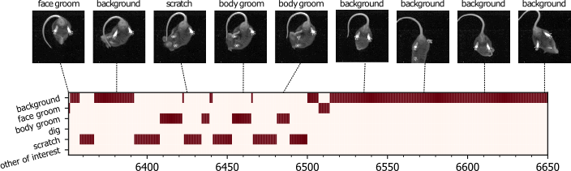
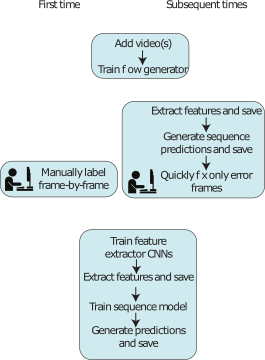

# Getting started

The goal of DeepEthogram is as follows: 
* You have videos (inputs)
* You also have a set of behaviors that you've defined based on your research project / interests
* You want to know, for every frame, which behaviors are present on that frame
* DeepEthogram will learn a mapping , where
p(k,t) is the probability of behavior k on frame t. X is the video at time t. 
* These probabilities are thresholded to give a binary prediction. The binary matrix of each behavior at each timepoint is what we call an *ethogram*. 
* To train this model, you must label videos manually for each behavior at each timepoint. 
* After training, you can run inference on a new video. Most of the frames should be labeled correctly. You can then quickly edit the errors.

This is schematized below: 

In the above figure, the image sequence are our inputs, and the ethogram is depicted below. 

## Installation
See [the installation documentation](installation.md). 

## Making a project
The most important decision to make when starting a DeepEthogram project is which behaviors to include. Each frame must have a label 
for each behavior. While DeepEthogram contains code for adding and removing behaviors, all previous models must need to be 
retrained when a behavior has been added or removed. After all, if you used to have 5 behaviors and now you have 6, 
the final layer of the neural network models will all have the wrong shape. Furthermore, previously labeled videos must be 
updated with new behaviors before they can be used for training. 

Open your terminal window, activate your `conda` environment, and open the GUI by typing `deepethogram`. For more information, see 
[using the GUI](using_gui.md). 

Go to `file -> new project`. Select a location for the new project to be created. It is *essential* that the project
be created on a Solid State Drive (or NVMe drive), because during training DeepEthogram will load hundreds of images per second. 

After selecting a location, a screen will appear with three fields: 
* `project name`: the name of your project. Examples might be: `mouse_reach`, `grooming`, `itch_mutation_screen`, etc.
* `name of person labeling`: your name. Currently unused, in the future it could be used to compare labels between humans. 
* `list of behaviors`: the list of behaviors you want to label. Think carefully! (see above). Separate the behaviors with commas. 
Do not include `none`, `other`, `background`, `etc`, or `misc` or anything like that. 

Press OK. 

A directory will be created in the location you specified, with the name `projectname_deepethogram`. It will initialize the 
file structure needed to run deepethogram. See [the docs](file_structure.md) for details. 

## Edit the default configuration file
For more information see [the config file docs](using_config_files.md). 

## Add videos
When you add videos to DeepEthogram, we will **copy them to the deepethogram project directory** (not move or use a symlink). We highly 
recommend starting with at least 3 videos, so you have more than 1 to train, and 1 for validation (roughly, videos are assigned to splits
probabilistically). When you add videos, DeepEthogram will automatically compute mean and standard deviation statistics
and save them to disk. This might take a few moments (or minutes for very long videos). This is required for model training
and inference. 

## Download models
Rather than start from scratch, we will start with model weights pretrained on the Kinetics700 dataset. Go to 
TODO: INSERT GOOGLE DRIVE LINK HERE. Unzip the files in your `project/models` directory. The path should be 
`your_project/models/pretrained/{models 1:6}`. 

## Start training the flow generator
These models (see paper) estimate local motion from video frames. They are trained in a self-supervised manner, so they
require no labels. First, select the pretrained model architecture you chose with the drop down menu in the flow_generator box. 
Then simply click the `train` button in the `flow_generator` section on the left
side of the GUI. The model will use the architecture you've put in your configuration file, or `TinyMotionNet` by default. 
You can continue to label while this model is training. 

## Label a few videos
To see how to import videos to DeepEthogram and label them, please see [using the GUI docs](using_gui.md).

## Train models!
The workflow is depicted below. For more information, read the paper. 

1. Train the feature extractor. To do this, use the drop down menu to select the pretrained weights for the architecture
you've specified in your configuration file. Then click `train`. This will take a few hours at least, perhaps overnight 
the first time.
2. Run inference using the pretrained feature extractor. The weights file from the model you've just trained should be
pre-selected in the drop-down menu. Click `infer`. Select the videos you want to run inference on. This will go frame-by-frame
through all your videos and save the 512-d spatial features and 512-d motion features to disk. These are the inputs to our 
sequence model. 
3. Train the sequence model. In the sequence box, simply click `train`. 
4. Run inference using the sequence model, as above. 

Now, you have a trained flow, feature extractor, and sequence model. 

## Add more videos
Using the GUI, add videos to your project. After you add the videos, as depicted in the workflow figure above, 
extract features to disk. This will take about 30-60 frames per second, depending on the model and your video resolution. 
Then run inference using the pretrained sequence model (should be instantaneous).

Now, for your newly added videos, you have probabilities and predictions for every video frame. Use the `import predictions as labels`
button on the GUI, and it will move the predictions to your labeling box. There, you can quickly edit them for errors.

## Re-train models
Now that you have even more videos and labels, we want to incorporate these into our models. Use the "train models" workflow above
to re-train your previous models with the new data.

## Continued usage
Continue cyling through the above workflow
* add videos
* run inference
* edit model errors
* retrain models  