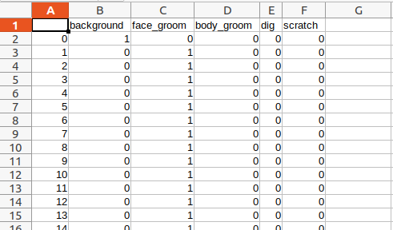

# Using the command line interface

A common way to implement a simple command line interface is to use python's builtin [argparse module](https://docs.python.org/3/library/argparse.html).
However, for this project, we have multiple model types, which share some hyperparameters (such as learning rate) while also 
having unique hyperparameters (such as the loss function used for the optic flow generator). Furthermore, I've put a lot of 
thought into default hyperparameters, so I want to be able to include defaults. Finally, each user must override specific hyperparameters
for their own project, such as the names of the different behaviors. Therefore, for the CLI, we want to be able to 
* have nested arguments, such as train.learning_rate, train.scheduler, etc
* be able to use configuration files to load many parameters at once
* be able to override defaults with our own configuration files
* be able to override everything from the command line

Luckily, [OmegaConf package](https://omegaconf.readthedocs.io/en/2.0_branch/) does a lot of this for us! Therefore, we use OmegaConf configurations for everything.

## Common usage
For all DeepEthogram projects, we [expect a consistent file structure](file_structure.md). Therefore, when using the CLI, always use the flag
`project.config_file=path/to/config/file.yaml` or `project.path=path/to/deepethogram_project`

## Creating a project in code
If you don't want to use the GUI, you still need to set up your project with the [consistent file structure](file_structure.md). 


### Make a project directory
You will need to open a python interpreter, or launch a Jupyter notebook. 

First, let's create a project directory with a properly formatted `project_config.yaml`
```python
from deepethogram import projects

# this is a path to a base directory on your hard drive
# this is just an example! change this to whereever you want, e.g. 'C:\DATA\movies`
data_path = '/mnt/DATA'

# pick a project name
project_name = 'open_field'

# make a list of behaviors. try to choose your behaviors carefully! 
# you'll have to re-train all your models if you add or remove behaviors. 
behaviors = ['background', 
            'groom', 
            'locomote', 
            'etc1', 
            'etc2']

# this will create a folder called /mnt/DATA/open_field_deepethogram
# there will be subdirectories called DATA and models
# there will also be a project_config.yaml
project_config = projects.initialize_project(data_path, project_name, behaviors)
```

### add videos and labels

This presumes you have a list of movies ready for training, and separately have labeled frames. 

The labels should be `.csv` files with this format: 
* there should be one row per frame. The label CSV should have the same number of rows as the video has frames. 
* there should be one column for each behavior. the name of the column should be the name of the behavior. The order
should be the same as you specified in the `project_config` above. 
* the first column should be called "background", and it is the logical not of any of the other columns being one. 
  * NOTE: if you don't have this, `projects.add_label_to_project` will do this for you!
* there should be a 1 if the labeled behavior is present on this frame, a zero otherwise. 



Here's an example in code: 

```python
# adding videos
list_of_movies = ['/path/to/movie1.avi', 
                 '/path/to/movie2.avi']
mode = 'copy' # or 'symlink' or 'move'

# depending on the mode, it will copy, symlink, or move each video file
# it will also compute the mean and standard deviation of each RGB channel
for movie_path in list_of_movies:
    projects.add_video_to_project(project_config, movie_path, mode=mode)


# now, we have our new movie files properly in our deepethogram project
new_list_of_movies = ['/mnt/DATA/open_field_deepethogram/DATA/movie1.avi', 
                      '/mnt/DATA/open_field_deepethogram/DATA/movie2.avi']

# we also have a list of label files, created by some other means
list_of_labels = ['/mnt/DATA/my_other_project/movie1/labels.csv', 
                  '/mnt/DATA/my_other_project/movie2/labels.csv']

for movie_path, label_path in zip(new_list_of_movies, list_of_labels):
    projects.add_label_to_project(label_path, movie_path)
```

### Add pretrained models to your project/models directory
For detailed instructions, please go to [the project README's pretrained models section](../README.md)

## Training examples
To train the flow generator with the larger MotionNet architecture and a batch size of 16: 

`deepethogram.flow_generator.train project.config_file=path/to/config/file.yaml flow_generator.arch=MotionNet compute.batch_size=16`

To train the feature extractor with the ResNet18 base, without the curriculum training, with an initial learning rate of 1e-5: 
`deepethogram.feature_extractor.train project.config_file=path/to/config/file.yaml feature_extractor.arch=resnet18 train.lr=1e-5 feature_extractor.curriculum=false notes=no_curriculum`

To train the flow generator with specific weights loaded from disk, with a specific train/test split, with the DEG_s preset (3D MotionNet): 
`python -m deepethogram.flow_generator.train project.config_file=path/to/config/file.yaml reload.weights=path/to/flow/weights.pt split.file=path/to/split.yaml preset=deg_s`

To train the feature extractor on the secondary GPU with the latest optic flow weights, but a specific feature extractor weights:
`python -m deepethogram.feature_extractor.train project.config_file=path/to/config/file.yaml compute.gpu_id=1 flow_generator.weights=latest feature_extractor.weights=path/to/kinetics_weights.pt`

# Questions?
For any questions on how to use the command line interface for your training, please raise an issue on GitHub. 