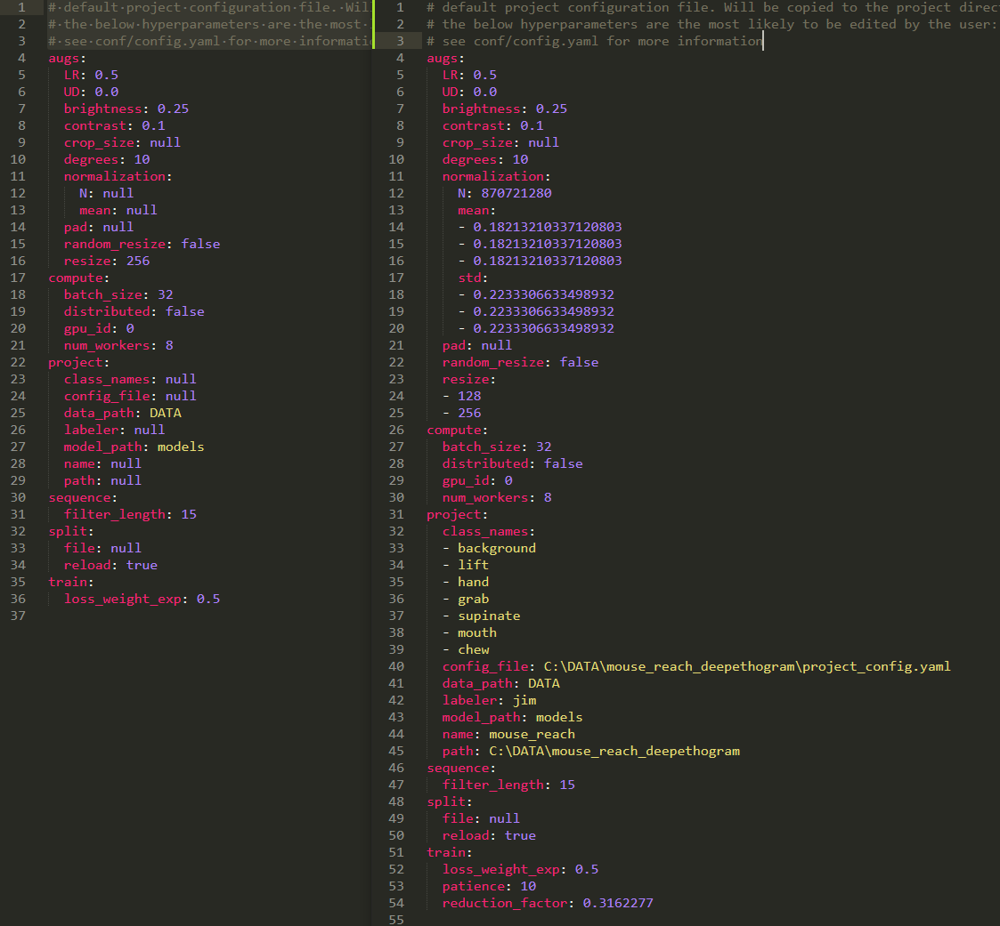

# Using project configuration files

DeepEthogram uses configuration files (.yaml) to save information and load hyperparameters. [For reasoning, see the
CLI docs](using_CLI.md). In each project directory is a file called `project_config.yaml`. There, you can edit model
architectures, change the batch size, specify the learning rate, etc. Both the GUI and the command line interface
will overwrite the defaults with whatever you have in this configuration file.

Hyperparameters can be specified in multiple places. Let's say you want to experiment with adding more regularization
to your model. The weight decay is specified in multiple places:
* the defaults in `deepethogram\conf\model\feature_extractor.yaml`
* maybe in your project configuration file
* the command line with `feature_extractor.weight_decay=0.01`

Per [the hydra docs](hydra.cc), the loading order is as follows, with the last one actually being used:
`default -> project config -> command line`. This means even if you normally use `weight_decay=0.001` in your project
configuration, you can still run experiments at the command line.

## How to edit your project configuration file
Navigate to your project dictionary with your `project_config.yaml` file. Importantly: **not every hyperparameter
will be in the default project configuration! This means if you want to edit a less-used hyperparameter, you'll
have to add lines to the configuration, not just edit them.**

The left part of the below screenshot shows the default project configuration in `deepethogram/conf/project/project_config.yaml`.
The right shows my configuration for the `mouse_reach` example [used in the GUI docs](using_gui.md).



Note the following:
* `augs/normalization` has been overwritten for the statistics of my dataset
* I've edited `augs/resize` to resize my data to be 128 tall and 256 wide. This speeds up training, and the images are
not square due to the multiple views that I've concatenated side by side ([see the GUI docs](using_gui.md)).
* the `project` dictionary has been totally changed
* I've added lines to the train dictionary:
  * `patience: 10`: this means the learning rate will only be reduced if learning stalls for 10 epochs
   (see `deepethogram/conf/train.yaml` for explanation)
   * `reduction_factor: 0.3162277`: this means the learning rate will be reduced by this value (1 / sqrt(10), which means
   the learning rate will go down by a factor of 0.1 after two steps)

This is how to edit a configuration file. You *add or edit fields in your project config in the nested structure shown in `deepethogram/conf`.*
For example, the `train` dictionary in the config file takes values shown in `deepethogram/conf/train.yaml`.
To find out what hyperparameters there are and what values they can take,
read through the configuration files in `deepethogram/conf`. The most commonly edited ones are already in the
default `project_config.yaml`, such as batch size and image augmentation.

## Creating configuration files in code
If you want to use functions that require a configuration file, but want to use the codebase instead of the command
line interface, you can create a nested dictionary with your configuration, then do as follows:
```python
from omegaconf import OmegaConf
nested_dictionary = {'project': {'class_names': ['background', 'etc', 'etc']},
                     'etc': 'etc'}
cfg = OmegaConf.create(nested_dictionary)
print(cfg.pretty())
# etc: etc
# project:
#   class_names:
#   - background
#   - etc
#   - etc
```
