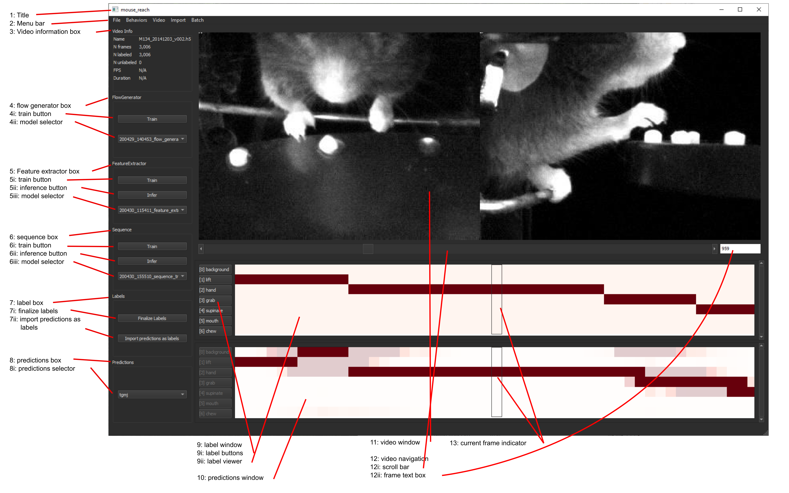

# Using the GUI

To open: After [installation](installation.md), open a terminal, activate your conda environment, and type `deepethogram`.

To start your project, see the [getting started](getting_started.md) guide. The images in this guide are from a project
with multiple trained models, for illustration. Note: all examples are used from the [mouse reach dataset, available here](http://research.janelia.org/bransonlab/MouseReachData/). 
I've added my own labels, using the start frame labels provided.

When using the GUI, be sure to keep open and look at the terminal window. Useful information will be displayed there.

## Labeled GUI

1. Title: title of your deepethogram project
2. Menu
    - File
        1. New project: create an existing project. See [this doc file](getting_started.md)
        2. Open project: opens an existing project. Automatically opens the most recently added video, and imports any 
        existing labels or predictions. Changes the working directory to the project directory. 
        3. Save project (ctrl+s): Saves the current labels to disk. Note: if you haven't *finalized labels* (**7i**), 
        currently unlabeled frames will be labeled as `-1`. DeepEthogram will ignore these videos when training! 
    - Behaviors
        1. Add: adds a behavior to the current project. Use sparingly! All previous videos will have to be re-labeled. 
        Existing models will have to be re-trained. Avoid if at all possible. 
        2. Remove: removes a behavior from the current project. Use sparingly! All previous videos will have their labels
        erased, never to be recovered. Models will have to be re-trained. Avoid if at all possible. 
    - Video
        1. Add or open: Opens a video file. If it's a part of the current DeepEthogram project, also imports any existing
        labels and predictions. Otherwise, it will copy the video to your project directory. It will be displayed in the
        video window (**11**). See [the add video documentation](getting_started.md#add-videos)
        2. Add multiple: with this you can select multiple video files to add to your project at once. 
    - Import
        1. Labels: imports labels from disk. This requires label files to have [the same structure as deepethogram labels](file_structure.md). 
        Not generally necessary for use. 
    - Batch
        1. Feature extractor inference + sequence inference: works the same as pushing feature extractor / infer (**6ii**)
        followed by sequence / infer (**7ii**). 
        2. Overnight: if you collected experimental videos during the day, this is a good button to push before leaving
        lab for the night. Does the following tasks in sequence: trains your existing flow generator with the new data (**4i**), 
        extracts features (**6ii**), and then generates sequence predictions (**7ii**). In the morning when you arrive back to lab, 
        your new videos should have predictions ready for you to edit. 
3. Video information box
     - Name: the filename of the video
     - N frames: number of total frames in the video
     - N labeled: number of frames with user-edited labels
     - N unlabeled: number of frames without user labels
     - FPS: frames per second of the current video. If the filetype does not have a FPS value (for example, a folder of images), 
     it will say N/A. The current video is an HDF5 file, which is just a wrapper around a list of images. Therefore, it
     has no FPS.
     - Duration: video duration in seconds. 
4. Flow generator box
    1. Train button: Train the flow generator. It will use hyperparameters from your project configuration file (or defaults
    specified in `deepethogram/conf`). See [using configuration files for details](using_config_files.md). This includes
    the model architecture (TinyMotionNet, MotionNet, TinyMotionNet3D). The weights to pre-load will be specified by the 
    model selector (**4ii**)
    2. Model selector: choose the weights to pre-load. *Note: if model architecture specified in your project configuration file
    does not match that of the selected weight file, model will train without properly loading weights!*
5. Feature extractor box
    1. Train button: Train the feature extractor. It will use hyperparameters from your project configuration file (or defaults
    specified in `deepethogram/conf`). See [using configuration files for details](using_config_files.md). This will 
    take a long time, perhaps overnight. To speed training potentially at the cost of model performance, set 
    `feature_extractor/curriculum = false` in your project configuration file. 
    2. inference button: Run inference using the feature extractor models. Clicking this button will open a list of videos
    in your project with check boxes. Videos without output files ([see file structure](file_structure.md)) will be 
    pre-selected. For each video you select, the feature extractors will run frame-by-frame and extract spatial
    features, flow features, and predictions and save them to disk. These will be loaded as inputs to the sequence 
    models (below). This may take a long time, as inference takes around 30-60FPS depending on video resolution and
    model complexity (see paper). 
    3. model selector: A list of models in your [models directory](file_structure.md). These are the weights that will 
    be loaded and fine-tuned when you train (**5i**) and used to run inference (**5ii**)
6. Sequence box
    1. Train button: Train the sequence model. It will use hyperparameters from your project configuration file (or defaults
    specified in `deepethogram/conf`). See [using configuration files for details](using_config_files.md).
    2. Inference button: Run inference with your sequence  model. Clicking this button will load a list of videos in 
    your project that already have some features extracted. Output files that do not have any predictions from the 
    currently selected (**6iii**) sequence architecture will be automatically pre-selected. If you don't see a video
    here, you need to run inference with your feature extractor first (**5ii**). This runs extremely fast, and should
    only take a few seconds for any number of videos. 
7. Label box
    1. Finalize labels: when labeling a video, particularly with rare behaviors, the vast majority of frames will be "background"
    (see paper). We want to be able to tell the difference between *this frame is background* and *I have not looked 
    at or labeled this frame yet*, so that you can partially label a video and then return to it. By default, when saving
    the project (**menu bar/file/save**), unlabeled frames are set to `-1` and the video is not used for training. 
    When you've fully labeled a video, instead of affirmatively going through every frame and labeling them as *background*,
    we will use this button. When you press this button, all unlabeled frames will  be set to background, and the video
    will be considered fully labeled. This video will be used by DeepEthogram for training (**5i, 6i**)
    2. Import predictions as labels: When you've trained all your models, added a new video, and run inference, you 
    will have a set of predictions (**10**). These could be useful to look at while manually labeling, or you can 
    move them to the labeling window (**9**) to be manually edited. Pushing this button will do that. 
8. Predictions box
    1. Predictions selector: For each video, you can have multiple predictions. For example, they could be the predictions
     from the feature extractor as well as the sequence model. The key will be the `sequence.latent_name` used when you
     run inference. By default, it is the architecture of the sequence model. Note that it is `tgmj` here (see paper). Using
     this selector will change the visualized predictions in the predictions window (**10**)
9. Label window
    1. Label buttons: these buttons are the ordered list of behaviors for your project. Each button corresponds to a row
    in the label viewer (**9ii**). Pushing this button will toggle the behavior (see below). Background is a special
    class: it is mutually exclusive with the other behaviors. Pushing the keyboard number keys denoted in brackets
    will also toggle the behavior. For more information, see [the labeling section](using_gui.md#labeling) below. 
    2. Label viewer: This is where you can view your manual labels. The current video frame is denoted with the 
    current frame indicator (**13**). Unlabeled frames will be partially transparent, with the "background" class pre-selected. 
    Labeled frames will be opaque (see image). The current frame is the "hand" behavior (in red). No other behaviors
    are present on this frame. A few frames behind, the animal was performing the "lift" behavior. For more information, 
    see [the labeling section](using_gui.md#labeling) below.
10. Predictions viewer
    * This is where you can see the currently selected (**8i**) model prediction. The probabilities of each behavior
    are shown transparently. The predictions (thresholded probability) are opaque. At the left of the image, 
    note that the "lift" behavior is wrongly predicted to be "background". However, the transparent probabilities are still
    dark red for both "lift" and "hand" at this point. This shows that the model suspects it might be "lift" or "hand", 
    but these behaviors are just below the threshold. At the right of the image, note that around the "grab" behavior, 
    the probabilities are high +/- a few frames from the true behavior. The model "knows" this section of video transitions
    from "grab" to "supinate" to "mouth", but is just off by a few frames. 
11. Video window
    * Your video will be displayed here. It will be resized to take up as much of the screen as possible
12. Video navigation
    1. Scroll bar: use this to navigate quickly through the video. 
    2. Frame text box: this shows the current frame (**13**). Edit this text box to jump to a specific video frame. 
13. Current frame indicator
    * This denotes which frame in the label viewer and predictions viewer (**9ii, 10**) correspond to the shown video frame.
    Toggling the label button will label this frame (**9i**). 
        

## Labeling
The label is a matrix. It has K rows (behaviors) and T columns (timepoints). The goal is for this matrix to have 1s 
when behavior *k* is present on frame *t*, and 0s everywhere else. The special behavior "background" will be 1 when 
there are no user-defined behaviors present on that frame. There are multiple ways to label a frame: 

#### Toggling
When you toggle a behavior, you start editing that behavior on the current frame (**13**). When a behavior is toggled, 
moving [forward in time](using_gui.md#video-navigation) will *add that behavior*. Moving backwards in time will 
*erase that behavior*. You can toggle a behavior one of two ways: 
1. Clicking the label buttons (**9i**)
2. Pushing the corresponding number key on your keyboard

#### Clicking
You can also click directly on the label viewer (**9ii**). 
* Clicking an unlabeled frame will add that behavior. 
* Clicking a labeled element of the matrix will erase that label. 
* Clicking, holding, and dragging to the right will add that behavior on all those frames
* Clicking, holding, and dragging to the left will remove that behavior on all those frames. 

## Video navigation
There are multiple ways to change video frames using the GUI. 

1. Use the arrow keys on your keyboard (recommended). Pressing `Ctrl+arrow` will jump further, 30 frames by default. 
2. Use the scroll bar and arrows (**12i**)
3. Edit the frame number in the frame text box (**12ii**)

 

  